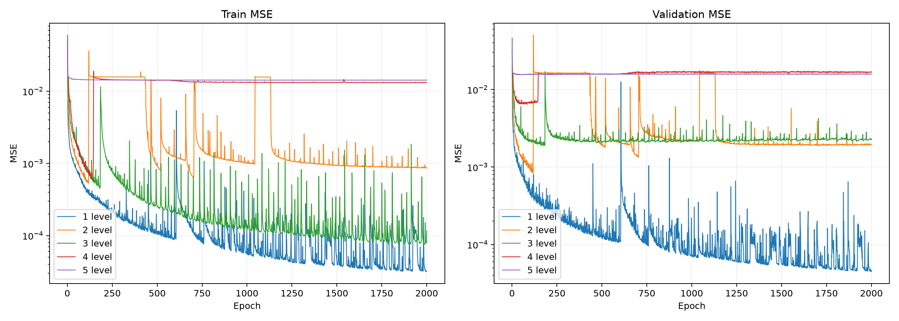

# 1–5 level autoencoder: 2000 epochs

Seed 20260917; fresh initialization; batch 4; Adam 0.001; no early stopping.

|Level|Final train MSE|Final validation MSE|Best validation MSE|Best epoch|
|---|---|---|---|---|
|1|3.16963075e-05|4.55748524e-05|4.47248059e-05|1999|
|2|0.000870813037|0.00193984071|0.000836471342|116|
|3|0.00011656891|0.00226622759|0.00187513744|176|
|4|0.0131503867|0.0168826669|0.00643538785|84|
|5|0.0142281707|0.015810245|0.0155054558|49|

Best weights minimize validation MSE; final weights are epoch 2000. Reconstruction HTML uses final weights. A loss plateau does not establish good reconstruction quality. Longer training does not guarantee improvement; compare best and final checkpoints. Portable notebooks use data/balls_128 by default or AE_DATASET_ROOT. Run download_data.py first; see the repository README for environment setup.
